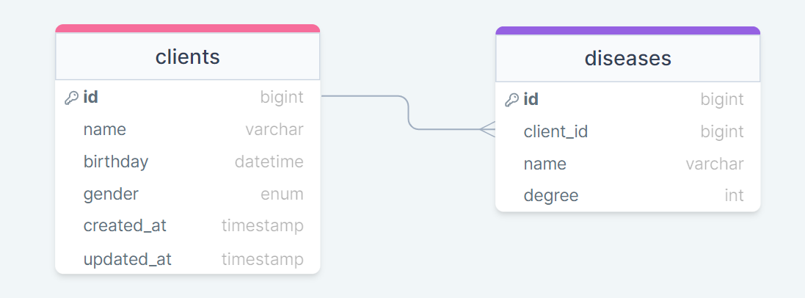

# 👨‍💻Sobre o projeto
"Hospital" é uma API REST que torna possível criar, listar e atualizar clientes de um hospital.

A API foi inspirada em um desafio técnico da [Oli Saúde](https://github.com/olisaude/teste-dev-backend).

## 💿Como rodar na sua máquina

### Pré requisitos: 

- **Git**;
- **Docker + Docker-Compose (caso queira utilizar Docker)**;
- **Java 17 (caso queira utilizar o Maven)**

<details>
    <summary><b style="font-size:1.4em;">🐳Utilizando Docker</b></summary>

```shell
# Clone o repositório na sua máquina
$ git clone https://github.com/lleonardus/hospital-api.git

# Abra a pasta do projeto
$ cd hospital-api

# Inicie o projeto usando Docker
$ docker-compose up
```

Após esse processo, a API vai estar rodando em **http://localhost:8080**.

</details>

<details>
    <summary><b style="font-size:1.4em;">♨️Utilizando Maven</b></summary>

 ```shell
# Clone o repositório na sua máquina
$ git clone https://github.com/lleonardus/hospital-api.git

# Abra a pasta do projeto
$ cd hospital-api

# Inicie o projeto usando Maven
$ ./mvnw spring-boot:run
```

Após esse processo, a API vai estar rodando em **http://localhost:8080**
e o banco de dados (H2 database) pode ser acessado em **http://localhost:8080/h2-console/**

</details> 

## 🗺️Diagrama Entidade Relacionamento (Banco de dados)



## 🎯Endpoints

### 👨‍👩‍👦‍👦Clients

- **GET** `/clients`: Lista todos os clientes registrados.
- **GET** `/clients/higher-health-risk`: Lista os 10 clientes com maior risco de saúde. O risco é medido através
da equação **(1 / (1 + eˆ-(-2.8 + sd ))) * 100**, onde **sd é a soma dos graus das doenças de um cliente**.

- **GET** `/clients/{id}`: Retorna um cliente em específico.
- **POST** `/clients`: Cria um cliente.
- **PUT** `/clients/{id}`: Edita os campos nome, data de nascimento e gênero de um cliente.

### Exemplo de JSON para cadastrar cliente

```json
 {
        "name": "Lisa",
        "birthday": "2022-12-31",
        "gender": "FEMALE",
        "diseases": [
            {
                "name": "Diabetes",
                "degree": 2
            }
        ]
 }
```

### Exemplo de JSON para atualizar cliente

```json
 {
        "name": "Lisandro",
        "birthday": "2000-12-31",
        "gender": "MALE"
 }
```

## 🧰Ferramentas utilizadas

- Java 17
- Spring Boot
- Spring Web
- Spring Data JPA
- H2 Database
- Docker
- Lombok
- Model Mapper
